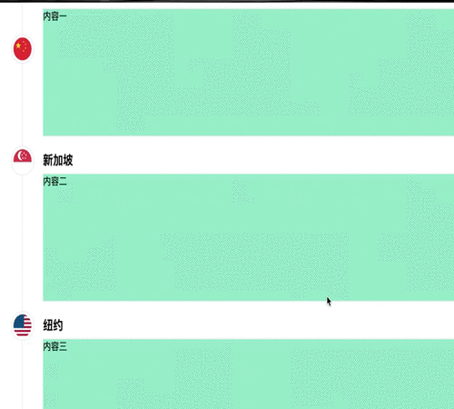

# vue-nav-sticky-axis

## 概述
> 一个基于vue2的可浮于顶部的导航轴

## 效果


## 安装

### 安装vue-nav-sticky-axis
``` bash
npm install vue-nav-sticky-axis
```
### 加载vue-nav-sticky-axis模块
支持es6的加载方式
```
import {NavStickyAxis, NavStickyAxisSlot} from 'vue-nav-sticky-axis'
```
也可以在 html 文件中使用 script 标签引入脚本，访问全局变量 Vue2Waterfall
```
<script src="dist/vue-nav-sticky-axis.min.js"></script>
```

## 使用
```
<nav-sticky-axis :top="50">
  <nav-sticky-axis-slot
    v-for="(item, index) in list"
    :key="index"
    :nav-img="item.img"
    :nav-text="item.navText"
    :index="index"
  >
    <section class="content">
      {{item.info}}
    </section>
  </nav-sticky-axis-slot>
</nav-sticky-axis>
```
### 选项
nav-sticky-axis的属性

| 属性 | 描述 | 默认值 | 类型 |
| --- | --- | --- | --- |
| top | 导航按钮浮动时距离顶部距离 | 0 | Number |

nav-sticky-axis-slot的属性

| 属性 | 描述 | 默认值 | 类型 | 是否必须 |
| --- | --- | --- | --- | --- |
| nav-img | 导航按钮里的图片 | - | String | 是 |
| nav-text | 导航标题文字 | '' | String | 否 |
| index | 当前导航的index，从0开始递涨，不可重复 | - | Number | 是 |


